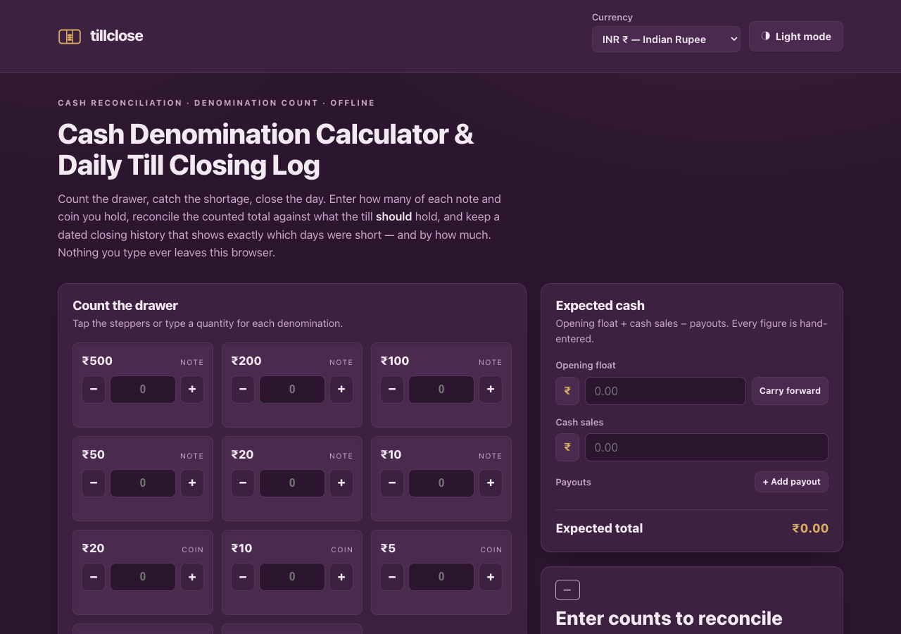

# tillclose

**Count the drawer, catch the shortage, close the day.** A cash denomination
calculator and daily till-closing log for anyone who counts a drawer at the end
of a shift — kirana stores, food stalls, salons, pharmacies, petrol-pump
handovers, event treasurers. 100% client-side, zero dependencies, works fully
offline. Your cash figures never leave the browser.



## Why

Closing a till is the same three-step job everywhere: count what's physically in
the drawer by denomination, work out what *should* be there (opening float plus
cash sales minus payouts), and record the difference. Do it on paper and the
denomination arithmetic is error-prone; do it in a spreadsheet and there's no
running history of which days ran short.

tillclose does exactly those three steps and nothing more. All money is computed
in **integer minor units** (paise, cents, pence, sentimo), so a decimal-currency
count never drifts by a rounding cent. It keeps a dated closing history so a
pattern of shortages becomes visible, and it prints a clean sign-off sheet for
the physical till file.

## Features

- **Denomination count grid** — five verified currency presets (INR, USD, EUR,
  GBP, PHP) rendered as drawer "wells" with +/− steppers and direct quantity
  entry; live per-row subtotals and a counted grand total.
- **Expected-cash panel** — opening float + cash sales − payouts (payouts are a
  small labelled add/remove list, e.g. "milk vendor"). Every figure is
  hand-entered, and the app says so.
- **Variance verdict** — counted − expected shown as **TALLIED / SHORT / OVER**
  with the exact difference, distinct semantic colours *and* a word stamp (state
  is never colour-only).
- **Closing history** — a dated list plus a summary strip (days closed,
  short/over/tallied counts, net and average variance, worst day highlighted).
  One closing per date; re-saving overwrites with confirmation.
- **"Other amount" adjustment row** — for commemorative coins, withdrawn notes
  (e.g. the ₹2000 note), or damaged currency not in the grid.
- **Float carry-forward** — one tap prefills today's opening float from the last
  saved closing.
- **Printable closing sheet** — denomination breakdown, expected math, variance,
  and "Counted by / Verified by" sign-off lines (print-to-PDF via your browser).
- **CSV export (RFC-4180)** — one row per closing for the accountant, plus a
  per-day denomination breakdown export.
- **Light and dark** — both WCAG-AA legible; system-preference aware with a
  manual toggle.

## Quickstart

Just open `index.html` in any modern browser — no build step, no server, no
install.

- **Local:** double-click `index.html`, or run a static server in the folder.
- **Hosted:** **[Open tillclose live](https://sreenivas-sadhu-prabhakara.github.io/tillclose/)**

Your draft count and saved closings live in this browser's local storage, so they
persist between visits on the same device.

## Currency presets

The five denomination sets are a snapshot of currently circulating notes and
coins per each central bank, verified on **2026-07-22** against the official
sources listed in [`sources/CITATIONS.md`](./sources/CITATIONS.md) (RBI,
U.S. Currency Education Program & U.S. Mint, ECB, Bank of England & Royal Mint,
and Bangko Sentral ng Pilipinas). The withdrawn ₹2000 note is intentionally left
out of the INR grid and handled via the adjustment row. Denominations change over
time — use the adjustment row for anything not listed.

## Testing

The core arithmetic lives in `data/engine.js` and is proven by Node self-tests
that re-derive every formula and assert the fixtures to the paise/cent:

```sh
node --test
```

The suite covers `countTotal`, `expectedCash`, `variance`, the history summary,
Indian vs western money formatting, all corpus invariants (60 denominations,
strict descending order, uniqueness, per-currency counts), a seeded 1,000-vector
property test proving Σ qty×value reconciles exactly with no float drift, and an
RFC-4180 CSV round-trip.

## Privacy

- A strict Content-Security-Policy sets `connect-src 'none'`: the app **cannot**
  make any network request even if it tried. The browser itself enforces the
  privacy guarantee — it is not merely promised.
- No external fonts, scripts, images, or analytics. Everything is self-contained.
- All logic runs in your browser. Nothing about your drawer, sales, or closings
  is ever transmitted or stored anywhere but your own device.
- Because there are no network dependencies, it works with **no signal at all**.

## Disclaimer

tillclose is a counting and reconciliation aid provided for general use only. It
is **not an accounting system and not financial, tax, audit, or legal advice.**
Variance is arithmetic, not fraud detection — a tallied drawer does not by itself
prove correct sales recording. Expected cash is only as accurate as the figures
you enter; the app cannot read your POS, bank, or UPI and never pretends to.
Denomination presets are a build-time snapshot (verified 2026-07-22) and may not
reflect later demonetisations or new issues — use the adjustment row and verify
against your central bank. All data lives only in your browser's local storage;
clearing site data erases it, so export the CSV regularly. Keep your statutory
books separately. This software is provided under the MIT License, "as is",
without warranty of any kind; the authors accept no liability for any loss or
damage arising from its use.

## License

[MIT](./LICENSE) © 2026 Sreenivas Sadhu Prabhakara
